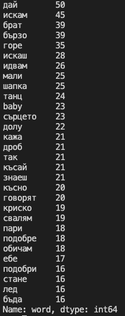
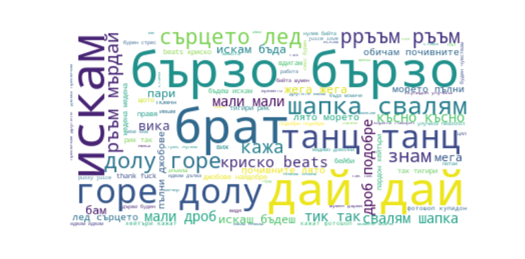
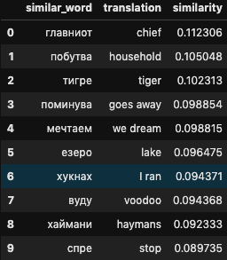
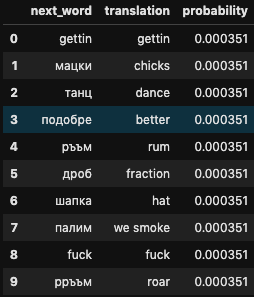
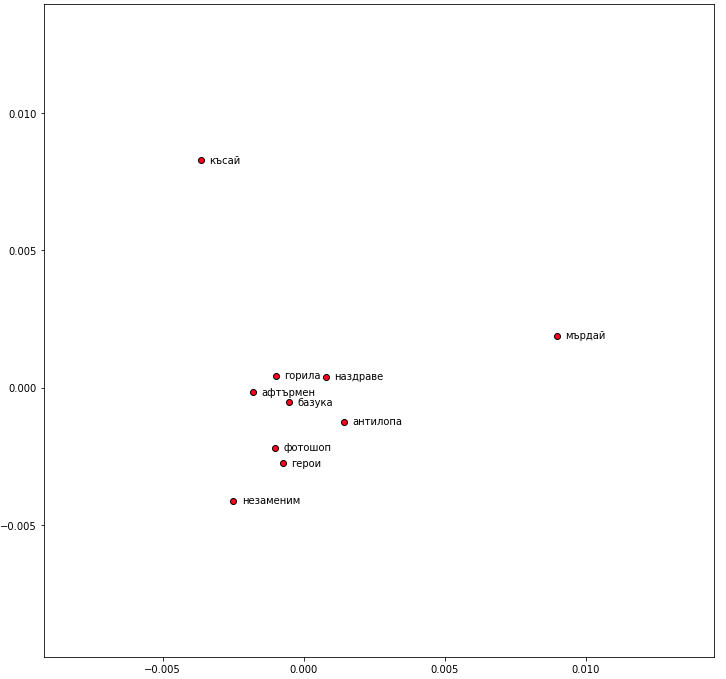

# Text Generator - Krisko
This project tries to perform various Natural Language Processing (NLP) in an unfamiliar language to me  -  Bulgarian. I will try to explore the data and at the end try to generate some Bulgarian sentences by using a machine learning model incorporating BiLSTM (Bidirectional Long and Short-term Memory) layers frin Krisko (one of the most famous Bulgarian singers/rappers)'s lyrics. This project is documented in my [medium blog]().
All the text data were collected from [Lyrics Translate](https://lyricstranslate.com/en/krisko-lyrics.html).

## Table of contents
- [Requirements](#requirements)
- [Text Data](#text-data)
- [Word2vec Analysis](#word2vec-analysis)
- [Generate Bulgarian Sentences](#generate-bulgarian-sentences)
- [Conclusion and Next Steps](#conclusion-and-next-steps)

## Requirements
```
Keras == 2.3.1
feather_format == 0.4.0
nltk == 3.3
numpy == 1.18.1
pandas == 0.23.4
spacy == 2.2.3
tensorflow == 1.14.0
```

## Text Data
There are 36 pieces of Krisko's lyrics, 16453 words and 3741 unique words.
Top 30 frequent words list and word cloud can be found below.





## Word2vec Analysis
Here use word2vec to explore the data deeper. This analysis could find similar words, next words and word embedding mapping of Song's title.


Here is the example of similar words to 'man'.



And next words of 'I want'.



And songs' title word embedding PCA mapping.



## Generate Bulgarian Sentences
Generate some sentences in Bulgarian by building a model from Krisko's lyrics data. The model will be including embedding and bidirectional LSTM (BiLSTM) layers. Below you can find a snippet of the modeling.

```
# Build a model

BATCH_SIZE = 128

model = Sequential()
model.add(Embedding(TOTAL_WORDS, 128, input_length=MAX_SEQ_LEN-1))
model.add(Dropout(.5))
model.add(Bidirectional(LSTM(128,return_sequences=False,
                                kernel_initializer='random_uniform')))
model.add(Dropout(.5))
model.add(Dense(TOTAL_WORDS, activation='softmax'))

model.compile(loss='categorical_crossentropy',
              optimizer=optimizers.Adam(lr=0.1,decay=.0001),
              metrics=['accuracy'])

model.fit(xs,ys,epochs=500,verbose=1)
```

And here you can find sentences the model generated:

Double BiLSTM layer model with 256 units - 1000 epochs

Искам един танц на не дължа да се разбивам да се да се моля бе на фитнес запали - (I want a dance I don't owe to break to pray it was on fitness lights)

Искаш да се възгордяваш да се възгордяваш няма никой те боли и не мога да върна духат любовта - (You want to be proud to be proud no one hurts you and I can't bring back love)

Аз съм купидон да се качиш да се моля да се фука напиеме теб ми бе се предавам - (I'm a cupid to get up to pray fuck you I was giving up)

Ти си жена да се фука се моля се моля да се моля бе але имам признавам любовта - (You are a woman to fuck please please pray was but I have to admit the love)

## Conclusion and Next Steps
This poject went through
- Data exploration
- Creating wordCloud visualisation
- Exploring more by using word2vec
- Building a text generator model using BiLSTM layers

Next steps would be:
- Generate lyrics (probably need more data)
- Try skipgram
- Improve the quality of data including \<eos> and \<sos>
- Create text generator API